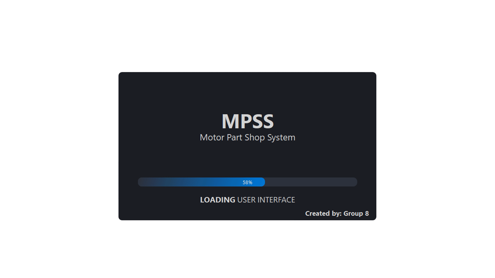

# MPSS - Motor Part Shop Software

A software for managing auto parts inventory with features like

<ul>
    <li>Buying new parts. </li>
    <li>Keep track of different vendors. </li>
    <li>Adding/Removing items. </li>
    <li>View total revenue at the end of day. </li>
    <li>View revenue graph for previous 30 days. </li>
</ul>


## Run Locally

Clone the project

```bash
  git clone https://github.com/Kargnin/MPSS.git
```

Go to the project directory

```bash
  cd MPSS
```

Install dependencies

```bash
  pip install -r requirements.txt
```

Copy "StatsData.db" from Startig Database folder and paste in project directory

Start the application

```bash
  python main.py
```

To view and edit the included design files use QT Designer.

## Screenshots



  
## TODO

- Additional Features like timeline and tools for graph analysis

  
## Authors

- [@Bhushan](https://www.github.com/Kargnin)
- [@Harshit](https://www.github.com/harshit0711)

  